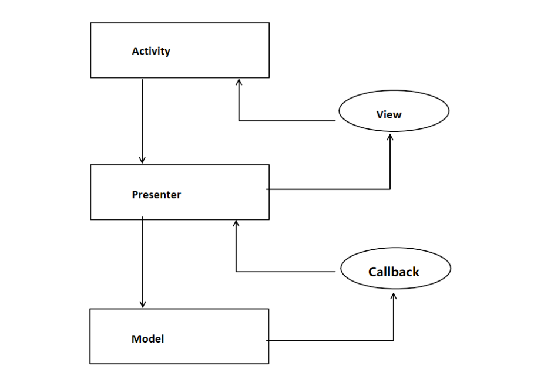
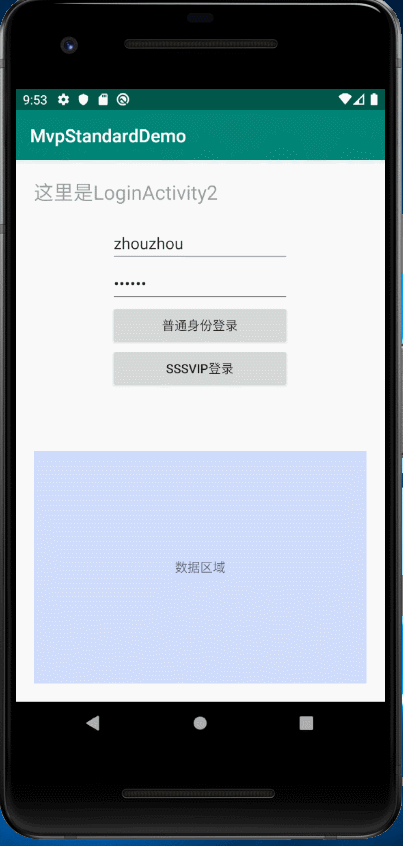

# MVP漫谈


MVP模式要解决的问题是：

最早的开发模式是MVC，M数据层，V 一般指的是xml布局文件，C控制层，一般用Activity或Fragment.随着业务扩展，版本迭代，往往会发现一个上千行的Activity或Fragment，臃肿不堪看起来简直难受。

后来出现了MVP，

M依然是数据层，只负责数据的获取，其他一改不管，传入入参和回调函数，M层的代码会调用回掉函数通知上一层。

V层，视图层，由之前的xml布局文件，扩充到Activity/Fragment/自定义View/自定义ViewGroup 只要是UI界面相关的东西，全都归类到V层。

P层，新概念，单词 Presenter，翻译为：**表现层**。功能类似于 **粘合剂**，它作为中间层，连接数据层M和视图层V，专门处理 **M和V这两口子**之间杂七杂八的破事儿。

M层，很纯粹，前面说过，只负责数据获取以及通知上层。

V，也很纯粹，V只负责界面元素的调度，它不会去管任何和具体业务相关的事。

MVP如下图所示，

Activity作为标准的V，它调用P层的方法来执行业务逻辑，P层则调用M层的接口来执行数据获取。

之后，M层通过P给的回调函数，通知P，P则根据具体的业务需求，执行V的UI调度接口。




MVC中，C层 Activity或Fragment膨胀的问题解决了。但是随之而来的，由于我们用了P层来处理业务逻辑，随着版本迭代，业务量越来越多，旧代码不敢删，新代码越来越多，P的代码也逐渐膨胀，于是又出现了和MVC相似的窘境。

没事，也有办法，使用接口约束，将大的P类，分成若干个小的P类，保证代码整洁清晰。一段时间之内，可能确实有效果。但是时间长了，会发现P接口很多，P实例也很多，难以管理，找一个业务的Bug，看到一大堆的P类，脑壳也是很疼的。

于是 Contract思想来帮我们解决这个问题。

所谓Contract，翻译为：合同，契约。它负责来对某一个业务的M V P三层进行统筹管理，如果你要去找一个 业务Bug，很简单，找到该业务的Contract类，所有的M层，V层,P层接口一目了然。

上代码：

```kotlin
class LoginContract {

    /**
     * 定义数据接口
     */
    interface Model : BaseModel {
        fun doLogin(username: String, password: String, httpCallback: HttpCallback<UserBean>)
    }

    /**
     * 定义View层的界面处理
     */
    interface View : BaseView {
        fun checkParams(): Boolean
        fun handleLoginResult(result: UserBean?)
    }

    /**
     * 定义P层的业务逻辑调用
     */
    interface Presenter : BasePresenter<BaseView> {
        fun doLogin(username: String, password: String)
    }

    // 这里是不是可以提供静态方法，得到具体的P和M对象
    companion object {
        fun getPresenter(view: View): Presenter {
            return LoginPresenter(view)
        }

        fun getModel(): Model {
            return LoginModel()
        }
    }


}
```

一个登录业务，

Model层，只需要提供一个doLogin方法即可，参数为字符串类型的username和password。

View层，则需要校验界面用户名，密码参数是否为空，我提供了一个checkParams方法，并且它需要处理登录之后的回调，我定一个接口 handleLoginResult。

Presenter层，它是要被View层调用的，我提供一个函数 doLogin, 参数username和password。

此外，提供2个共生体方法，getPresenter() 和 getModel()  只是为了让开发者统一的一个地方来获取M和P。至于V实例，一般都是Activity和Fragment，这两个东西，Activity是AMS创建实例的，不用我们多管，Fragment 则一般会手动去new 或者 用Fragment的静态方法 getInstance。所以此处不提供get方法。这里并不是一定要用共生体静态方法，也可以把Contract类写成单例，这里我节约时间没有这么做。

有了 LoginContract 类之后，再去 按照这里面约束的M,V,P接口去创建MVP三层的实体类。比如上面的M：

```kotlin
open class LoginModel : LoginContract.Model {

    override fun doLogin(username: String, password: String, httpCallback: HttpCallback<UserBean>) {
        HttpRequestManager.doLogin(username, password, httpCallback)
    }

}
```

```kotlin
open class LoginActivity : BaseActivity<LoginContract.Presenter>(), LoginContract.View {
	...

    override fun init() {
        btnLogin.setOnClickListener {
            if (checkParams()) {
                val username = tvUsername.text.trim().toString()
                val password = tvPassword.text.trim().toString()
                castPresenter().doLogin(username, password)
            } else {
                onError("有参数为空..")
            }

        }
    }


    override fun checkParams(): Boolean {
        return tvUsername.text.isNotEmpty() && tvPassword.text.isNotEmpty()
    }

    override fun handleLoginResult(result: UserBean?) {
        Log.d("handleLoginResult", result.toString())
        dataView.text = result.toString()
    }

    ...
}
```

```kotlin
open class LoginPresenter(view: LoginContract.View) : LoginContract.Presenter {

    //P类，持有M和V的引用
    // 为什么我要把 model 放在外面？一个业务类P，只会有一个model么？如果需要多个数据源呢？
    var model: LoginContract.Model? = null
    var view: LoginContract.View? = view

    override fun doLogin(username: String, password: String) {
        val v = view ?: return
        val m = model ?: return

        v.showLoading()
        m.doLogin(username, password, object : HttpCallback<UserBean> {
            override fun onSuccess(result: UserBean?) {
                v.hideLoading()
                v.handleLoginResult(result)
            }

            override fun onFailure(e: Exception?) {
                v.hideLoading()
                v.onError(e.toString())
            }

        })
    }

    ...
}
```

这样就能把一个业务的MVP三层统筹管理。韩信点兵多多益善，兵多不是问题，只要有擅长统兵的将领，我把将领管理好就行。

这里也是一样，再多的Presenter类，Model类，业务再复杂， 只要管理有方，就不会天下大乱。

Contract层正是我们的**统兵将领**

问题就解决了么？非也！

随着产品锦鲤的脑洞大开，各种奇葩的业务又来了。

比如：

之前有一个登录业务，一切都好好的，突然，产品要求，在原来的基础上，增加一个**SSSVIP**登录的功能，原来的登录业务代码保留，因为普通用户还用得着，**SSSVIP爸爸客户们**要用**尊贵**的 登录界面，What the ***! 

 之前我们用的MVP开发模式，加入了**Contract层** 统筹管理所有的**MVP**三层的所有类。试想一下，是不是每一个业务都需要开辟**自己的MVP**三层？答案是否定的，比如这里的 **SSSVIP登录业务**, 99%的业务代码可能都是一摸一样的，唯一不同的就是 登录接口要**新增**传入一个新的**UserType=SSSVIP**参数而已，那之前的 登录业务代码还用得着么?

当然用得着,作为一个有洁癖的程序猿，我们不允许重复代码。请看：

但是要说一句，每一个独立的业务都有自己的**Contract**，这是一定的，因为Contract就代表了当前业务的**统兵将领**。**SSSVIP**登录业务的Contract如下：

```kotlin
class LoginContract2 {
    interface Model : LoginContract.Model {
        fun doLogin2(
            username: String,
            password: String,
            userType: String,
            httpCallback: HttpCallback<UserBean>
        )
    }

    interface View : LoginContract.View {
        fun getUserType(): String
        fun handleLoginResultForSSSVIP(result: UserBean?)
        fun onErrorForSSSVIP(msg: String)
    }

    interface Presenter : LoginContract.Presenter {
        fun doLogin2(username: String, password: String, userType: String)
    }

    // 这里是不是可以提供静态方法，得到具体的P和M对象
    companion object {
        fun getPresenter(view: View): Presenter {
            return LoginPresenter2(view)
        }

        fun getModel(): Model {
            return LoginModel2()
        }
    }

}
```

上面的代码中，

内部接口 Model继承自 之前LoginContract.Model,这意味着，之前的登录接口可以复用。

内部接口View继承自 之前LoginContract.View，之前登录View层的约束不用重复写一遍了。

内部接口Presenter继承自 之前LoginContract.Presenter。

继承之后，只需要增加**SSSVIP**登录所需的特别方法就可以了，前面的逻辑完全复用起来了。

Model新增的接口：doLogin2（） 只是新增了一个userType参数

View层新增了3个接口。**getUserType()**获取当前的userType，**handleLoginResultForSSSVIP()**尊贵的VIP怎么可以和普通用户用一样的登录回调呢？安排起来。最后的 **onErrorForSSSVIP()**接口，让SSSVIP的登录报错也与众不同。

P层，新增一个doLogin2接口，和原来相比多了一个userType参数，V层调用这个接口把userType传递给P，最终给到M。

剩下的共生体，没有变化，只是为了让开发者在统一的地方获得M和P的实例。

Contract的复用问题解决了。那么接下来就是SSSVIP登录业务的 MVP三层实例，如何防止重复代码。

先看：Model

```kotlin
class LoginModel2 : LoginContract2.Model, LoginModel() {
    override fun doLogin2(
        username: String,
        password: String,
        userType: String,
        httpCallback: HttpCallback<UserBean>
    ) {
        HttpRequestManager.doLogin2(username, password, userType, httpCallback)
    }
}
```

它要继承 LoginContract2.Model接口 ，就必须实现 该接口的方法，但是由于  LoginContract2.Model 接口继承了 LoginContract.Model ，原则上在这里必须实现这两个方法 **doLogin**和**doLogin2**，但是很明显，如果把doLogin再写一遍，那就太low了。解决方式为：**在实现 LoginContract2.Model 的同时，继承LoginModel类**。这样，即可以实现SSSVIP特有的M层接口，又不用把普通用户的登录Model方法再写一遍。

剩下的 V和P也是类似：

 ```kotlin
class LoginPresenter2(view: LoginContract2.View) : LoginPresenter(view), LoginContract2.Presenter {

    override fun doLogin2(username: String, password: String, userType: String) {
        val m = model as LoginContract2.Model // 类型转换成 Login2Activity专用的 Model
        val v = view as LoginContract2.View
        v.showLoading()
        m.doLogin2(username, password, userType, object : HttpCallback<UserBean> {
            override fun onSuccess(result: UserBean?) {
                v.hideLoading()
                v.handleLoginResultForSSSVIP(result)
            }

            override fun onFailure(e: Exception?) {
                v.hideLoading()
                v.onErrorForSSSVIP(e.toString())
            }
        })

    }

    ...
}
 ```

doLogin不用再写一遍。

```kotlin
class LoginActivity2 : LoginActivity(), LoginContract2.View {
    override fun getLayoutId(): Int {
        return R.layout.activity_login2
    }

    override fun init() {
        super.init()
        // SSSVIP登录
        btnLogin2.setOnClickListener {
            if (checkParams()) {
                val username = tvUsername.text.trim().toString()
                val password = tvPassword.text.trim().toString()
                castPresenter().doLogin2(username, password, getUserType())
            } else {
                onErrorForSSSVIP("有参数为空..")
            }
        }
    }

    override fun getUserType(): String {
        return "SSSSVIP"
    }

    override fun handleLoginResultForSSSVIP(result: UserBean?) {
        // 为SSSVIP专门准备的登录结果处理
        Log.d("handleLoginResult", result.toString())
        dataView.text = "尊贵的 ${getUserType()} \n${result.toString()}"
    }

    override fun onErrorForSSSVIP(msg: String) {
        dataView.text = "尊贵的${getUserType()} \n$msg"
    }

}
```

LoginActivity2中，实现了尊贵VIP专享的登录结果回调，以及登录错误提示。

最后的效果：



MVP三层，代码重用的问题也OK了。

到了这里MVP的所有问题都解决了么？并没有。作为一个MVP架构，P层需要持有V层的引用，如果持有的是Activity，那么当Activity自己finish了自己，如果发现有另外的对象持有了Activity的引用，并且这个对象还是GCRoot（比如它正在执行耗时方法）那么Activity也是不能回收的。这种内存泄漏的问题有很多说法，网上也有很多解决方案，比较常见的就是，定义一个基类**BasePresenter**，提供一个抽象方法 **abstract fun release()**，要求所有的子类都去调用它来释放掉 **View**的引用，然后 在 **BaseActivity**中去调用这个 release()方法 。 这种做法确实可以 防止内存泄漏，但是随着**jetpack开源组件**的推广普及，出现了更加简洁的写法，**Lifecycle**. 使用LifeCycle可以比传统方法更加简洁优雅地处理内存泄漏。

定义一个基类 BasePresenter, 让他实现**LifecycleObserver**接口, 然后所有的P类实例就都变成了生命周期的观察者，可以随时接收View层生命周期的变化。当然，目前我们关心的只是onCreate 和 onDestrory，这两个生命周期关系着 view层的绑定和解绑。 

```kotlin
interface BasePresenter<V : BaseView> : LifecycleObserver {

    /**
     * 自动感知Activity/Fragment 的 onCreate生命周期，开始初始化一些全局变量
     *
     *
     */
    @OnLifecycleEvent(Lifecycle.Event.ON_CREATE)
    fun onCreate()

    /**
     * 自动感知Activity/Fragment 的 onDestroy生命周期,释放全局变量
     */
    @OnLifecycleEvent(Lifecycle.Event.ON_DESTROY)
    fun onDestroy()

}
```

依然用**LoginPresenter**举例：

```kotlin
open class LoginPresenter(view: LoginContract.View) : LoginContract.Presenter {

    //P类，持有M和V的引用
    // 为什么我要把 model 放在外面？一个业务类P，只会有一个model么？如果需要多个数据源呢？
    var model: LoginContract.Model? = null
    var view: LoginContract.View? = view

    override fun doLogin(username: String, password: String) {
        ...
    }

    override fun onCreate() {
        model = LoginContract.getModel()
    }

    override fun onDestroy() {
        model = null
        view = null
    }
}
```

一个P类，必须持有model和view的实例，model用来调用数据接口，view用来调用界面元素。上面的代码中，view的绑定，我用构造函数来传递，时机上和onCreate相同。而在**view** **onDestroy**的时候，直接让**view=null**释放引用. 这样，在Activity onDestroy，即将回收的时候，引用链断开了，杜绝内存泄漏。Fragment的处理也是类似。

当然，还有一个重要步骤，**注册观察者到View实例中**

```kotlin
abstract class BaseActivity<T : BasePresenter<BaseView>> : AppCompatActivity() {
    ...

    override fun onCreate(savedInstanceState: Bundle?) {
        ...
        lifecycle.addObserver(mPresenter) // 利用 lifecycle 防止内存泄漏
    }
}
```

 LifeCycle使用非常简单，原理上这里就不细讲了，非本文重点。

比较容易忽略的是，防止内存泄漏之后的目的达成了，如果在P执行M层数据的过程中，Activity被回收，P类的view成员被置为NULL，就很有可能报出空指针异常，造成崩溃，所以，在P类中，用到view的地方，最好都判空，因为不一定view什么时候会解绑。或者整个方法抛出空指针异常，也可以。


另外，打造一个完整的MVP开发框架，上文所描述的东西还不够。做框架的目的是**立标准**,立标准是为了团队协作开发的可持续发展。除了上面所说的所有内容，还要对MVP的基类进行抽取，定义泛型参数对 实例类进行约束。

基类的抽取，下文将会讲述。


