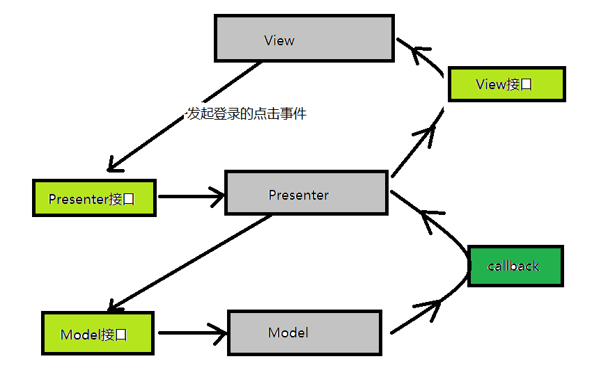
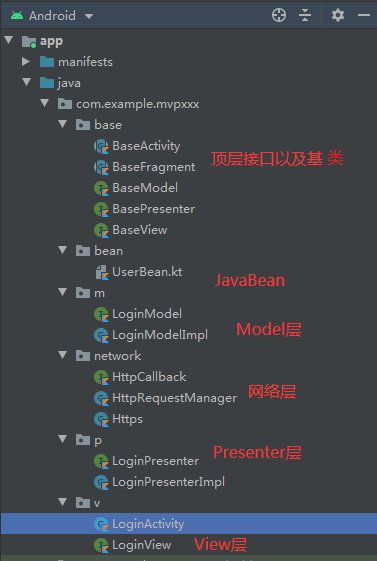
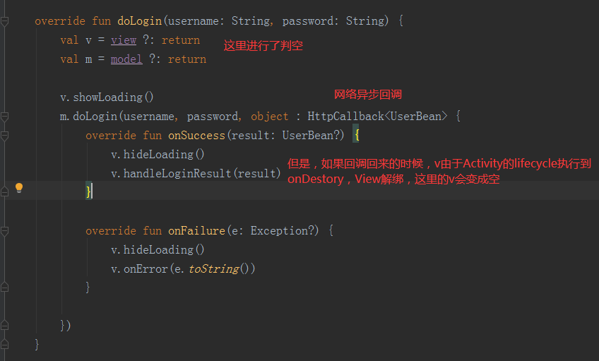
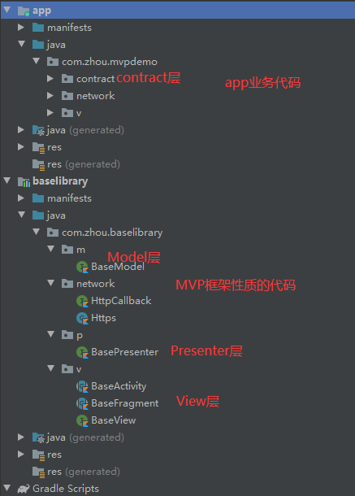

# 前言

最近**Review**公司代码，发现很多人只知**MVP**模式其名，而不知其原理，滥用**Presenter**类，有些甚至都没有用P接口，导致项目难以维护。翻阅了网络上很多关于**MVP**的文章，大多数都没有给出可研究的实例，笔者觉得，写一个"相对标准"版的教程是有必要的。本文将从**MVP**开发模式的思想，到对**MVC远古代码进行改造**，一步一步提炼出MVP开发框架。并提供可研究的**Github**项目**Demo**。

# 正文大纲

- 最早的MVC
- 后来的MVP
- 新出炉的MVVM
- MVP模型图
- MVP的优势和问题
- MVP框架Demo解读
  - 完成核心功能
  - 接口/基类抽取
  - 解决Bug
  - 框架代码分离

# 正文


## 最早的MVC

最早的开发模式是MVC，

| 层级  |                   含义                   |
| ----- | :--------------------------------------: |
| **M** |           数据层,纯粹获取数据            |
| **V** |      视图层，一般指的是xml布局文件       |
| **C** | 控制层，一般用**Activity**或**Fragment** |

随着业务扩展，版本迭代，往往会发现一个**上千行**的**Activity**或**Fragment**，臃肿不堪看起来简直难受,而且难以维护。

## 后来的MVP

| 层级  |                             含义                             |
| :---- | :----------------------------------------------------------: |
| **M** | 依然是数据层，只负责数据的获取.其他一改不管，传入入参和回调函数，M层的代码会调用回掉函数通知上一层 |
| **V** | 视图层，由之前的xml布局文件，扩充到**Activity/Fragment/自定义View/自定义ViewGroup** 只要是UI界面相关的东西，全都归类到V层。 |
| **P** | 新概念，单词 **Presenter**，翻译为：**表现层**。功能类似于 **粘合剂**，它作为中间层，连接数据层M和视图层V，       专门处理 **M和V这两口子**之间杂七杂八的破事儿。 |

**M**层，很纯粹，前面说过，只负责数据获取以及通知上层。理论上来说，**M**层可以单独进行测试，检查数据接口是否正常。**V**层，也很纯粹，**V**只负责界面元素的调度，它不会去管任何和具体业务相关的事。**V**层也可以安排假数据单独进行交互性测试。**P,** 则像个媒人，把两个纯粹的"男女"撮合起来。

## 最新出炉的MVVM

**MVP**优于**MVC**，但是随着谷歌发布**Databinding**，**MVVM**成了更加新潮的选择，利用数据模型的双向绑定，开发中确实可以节约不少代码量，但是**MVVM**也有不尽如人意的地方，比如**Debug**困难, 比如**代码侵入XML**，比如**学习成本较高**等等。本文仅提及一下，不作深入讨论。

## MVP模型图

**Activity**作为标准的**V**，它调用**P**层的方法来执行业务逻辑，**P**层则调用**M**层的接口来执行数据获取。

之后，**M**层通过**P**给的**callback**回调函数，通知**P**，**P**则根据具体的业务需求，执行**V**的**UI**调度接口。


## MVP的优势与问题

利用**MVP**，原来**MVC**中**C**层 **Activity**或**Fragment**膨胀的问题解决了。

但是随之而来的，由于我们用了**P**层来处理业务逻辑，随着版本迭代，业务量越来越多，旧代码不敢删，新代码越来越多，**P**的代码也逐渐膨胀，于是又出现了和MVC相似的窘境。

没事，也有办法，使用接口约束，将大的**P**类，分成若干个小的**P**类，保证代码整洁清晰。一段时间之内，可能确实有效果。但是时间长了，会发现**P**接口很多，**P**实例类也很多，可能还存在各种错综复杂的继承关系，难以管理，找一个业务的**Bug**，看到一大堆的**P类**，脑壳也是很疼的。

于是 **Contract** 思想来帮我们解决这个问题。

所谓**Contract**，翻译为：**合同，契约**。它负责来对某一个业务的**M V P**三层进行统筹管理，如果你要去找一个 业务**Bug**，很简单，找到该业务的**Contract**类，所有的**M层，V层,P层**接口一目了然。

```java
class XXXContract{
	interface Model{xxx}
	interface View{xxx}
	interface Presenter{xxx}
}
```

但是，问题总是源源不断。后续的，还有**MVP**中的内存泄漏的问题，因为**P**层要持有V层的引用。以及复杂业务下**Contract**的管理问题,需要一定的学习研究时间成本。

而且最关键的是，我们做一个**MVP**开发框架，是为了什么？是为了**立标准**。**立标准**是为了团队协作开发的可持续发展,保证项目代码可以健康地发展迭代，而不用为了重构而大费精力。但是，思考一下，一个很小的业务，一定需要我们定MVP三层来实现么？也不一定。

## MVP框架Demo解读

开发一个**MVP**框架，除了框架源码之外，还需要一个完整的文档资料，供使用者阅读学习。

本文Demo地址：https://github.com/18598925736/MvpDemo，建议下载源码对照阅读。

一般框架的开发设计思路都是， 

- **完成核心功能**

  MVP开发框架的核心功能，就是分离 **M模型层**，**V视图层** 和 **P控制层**

- **接口/基类抽取**

  对于常用的类，定义统一的抽象类或者接口，来约束该类的行为。这里必须对Activity和Fragment，还有自定义View进行抽取，因为他们都有可能成为 **V视图层**。 这里可能会用到 泛型约束。

- **解决Bug**

  为了快速实现功能，可能会存在一些隐藏Bug，比如MVP的内存泄漏问题。解决MVP内存泄漏带来的**View**空指针问题等等。

- **框架代码分离**

  框架代码应该单独存在一个module中，以便团队复用。

接下来以这4个步骤分别解读, 以一个**最简单的登录功能**为例：

### 完成核心功能

要分层，首先要找好分层的对象。先来看一段远古**MVC**代码,标准的**C层**写法. 其中**M层**，我使用的是**HttpRequestManager**，统一管理所有网络请求,**V层XML**我就不展示了：

```kotlin
class LoginActivity : AppCompatActivity() {

    override fun onCreate(savedInstanceState: Bundle?) {
        super.onCreate(savedInstanceState)
        setContentView(R.layout.activity_login)

        btnLogin.setOnClickListener {

            val username = tvUsername.text.trim().toString()
            val password = tvPassword.text.trim().toString()

            progressBar.visibility = View.VISIBLE
            HttpRequestManager().doLogin(username, password, object : HttpCallback<UserBean> {
                override fun onSuccess(result: UserBean?) {
                    progressBar.visibility = View.INVISIBLE
                    dataView.text = result.toString()
                }

                override fun onFailure(e: Exception?) {
                    progressBar.visibility = View.INVISIBLE
                    dataView.text = e.toString()
                }

            })
        }
    }
}
```

众所周知，**MVC**的**C**层会随着业务无限膨胀。这里我要将其中的业务逻辑抽离出来形成**P**层。再把 **HttpRequestManager** 封装到M层。V层 原本是**XML**。现在把**Activity**扩充为**V**层的一部分。

**分层架构有一个铁则：接口分离。**分层之后，层级之间，**不允许**存在类和类的直接依赖关系, **必须通过接口进行约束**，要建立依赖，也必须**通过接口**。具体做法如下：

先分析M层，网络请求是**doLogin**，传入参数是字符串类型的**username**和**password**,以及一个**HttpCallback**回调。抽离成 **LoginModel** , 以及 它的实现类 **LoginModelImpl**:

```kotlin
interface LoginModel {
    fun doLogin(username: String, password: String, httpCallback: HttpCallback<UserBean>)
}
```

```kotlin
class LoginModelImpl : LoginModel {
    override fun doLogin(username: String, password: String, httpCallback: HttpCallback<UserBean>) {
        HttpRequestManager().doLogin(username, password, httpCallback)
    }
}
```

然后是，**V**层，如果仅仅考虑**UI元素调度**的话，V层中必须存在这么几个方法,用接口来约束：

```kotlin
interface LoginView {
    fun showLoading() // 展示加载中
    fun hideLoading() // 隐藏加载中
    fun onError(msg: String) // 展示报错信息
    fun onSuccess(msg: String) // 展示成功信息
}
```

将**Activity**抽离成**V层**：

```kotlin
class LoginActivity : AppCompatActivity(), LoginView {

    override fun onCreate(savedInstanceState: Bundle?) {
        super.onCreate(savedInstanceState)
        setContentView(R.layout.activity_login)
        btnLogin.setOnClickListener {}
    }

    override fun showLoading() {
        progressBar.visibility = View.VISIBLE
    }

    override fun hideLoading() {
        progressBar.visibility = View.INVISIBLE
    }

    override fun onError(msg: String) {
        dataView.text = msg
    }

    override fun onSuccess(msg: String) {
        dataView.text = msg
    }
}
```

然后就是重点 P层，它是 M和V层的连接点，它负责调度M层的业务接口，也负责通知V层更新UI。它目前的核心任务就是，**doLogin**，用接口来表示：

```kotlin
interface LoginPresenter {
    fun doLogin(username: String, password: String)
}
```
三层已经分离完毕。接下来建立接口依赖。

先用P层连接V和M.

```kotlin
class LoginPresenterImpl : LoginPresenter {

    var model: LoginModel?
    var view: LoginView?

    constructor(view: LoginView) {
        this.view = view
        model = LoginModelImpl()
    }

    override fun doLogin(username: String, password: String) {
        val m = model ?: return
        val v = view ?: return

        v.showLoading()
        m.doLogin(username, password, object : HttpCallback<UserBean> {
            override fun onSuccess(result: UserBean?) {
                v.hideLoading()
                v.onSuccess(result.toString())
            }

            override fun onFailure(e: Exception?) {
                v.hideLoading()
                v.onError(e.toString())
            }
        })
    }
}
```

然后用V连接P：

```kotlin
class LoginActivity : AppCompatActivity(), LoginView {
    private val presenter: LoginPresenter = LoginPresenterImpl(this)
    override fun onCreate(savedInstanceState: Bundle?) {
        super.onCreate(savedInstanceState)
        setContentView(R.layout.activity_login)
        btnLogin.setOnClickListener {
            val username = tvUsername.text.trim().toString()
            val password = tvPassword.text.trim().toString()
            presenter.doLogin(username, password)
        }
    }
    ...
}
```

到目前为止：MVP三层之间的关系就变成了下图所示：



至此，MVP三层之间再也没有直接的关联关系，他们想要调用下层，或者通知上层，都必须通过接口。分层完成。

### 接口/基类抽取

这里讨论的基类，主要指的是**Activity**或者**Fragment**，至于自定义**View**，虽然也可以作为**View**层 的一个实例，但是由于它的声明周期是跟随它所在的**Fragment**和**Activity**，所以这里不予讨论。另外，**M和P层**也定义接口来约束行为，哪怕是空接口，也是有必要的，避免业务扩展时猝不及防。

先看**接口抽取**：

三个顶层接口

```kotlin
/**
 * 模型基准接口,
 * 目前是暂时空白
 */
interface BaseModel {
}
```

```kotlin
interface BasePresenter<V : BaseView>  {
}
```

```kotlin
/**
 * 规定所有V层 对象共有的行为
 */
interface BaseView {

    /**
     * 显示加载中
     */
    fun showLoading()

    /**
     * 隐藏加载
     */
    fun hideLoading()

    /**
     * 当数据加载失败时
     */
    fun onError(msg: String)

}
```

**M和P**的接口暂时是空，**V**的接口 **BaseView**约束一些V层实例所共有的特性，当数据加载时，可能需要显示进度条菊花，当数据加载失败时，可能要做出提示。那数据加载成功时为什么没有定方法呢？ 这是因为，数据加载成功之后，界面所要加载的**JavaBean**不尽相同，我尝试过很多次使用泛型来进行约束，效果都不理想，最后把 **onSuccess**放到了更下层接口中。 而，`interface BasePresenter<V : BaseView>` 增加泛型参数，是为了约束实现类所绑定的View层实例，要求**View**层实例必须实现**BaseView**。

然后是基类抽取  **BaseActivity** 和 **BaseFragment**：

```kotlin
/**
 * Activity 基 类
 * 使用该类创建实体Activity类，必须在泛型中先指定它的 P类
 */
abstract class BaseActivity<T : BasePresenter<BaseView>> : AppCompatActivity() {
    /**
     * 布局ID
     */
    abstract fun getLayoutId(): Int

    /**
     * 界面元素初始化
     */
    abstract fun init()

    /**
     * 业务处理类P
     */
    lateinit var mPresenter: BasePresenter<BaseView>

    /**
     * P类对象强转, 强转之后才可以在V层使用
     */
    abstract fun castPresenter(): T

    /**
     * 綁定业务处理类对象
     */
    abstract fun bindPresenter()

    override fun onCreate(savedInstanceState: Bundle?) {
        super.onCreate(savedInstanceState)
        setContentView(getLayoutId())
        bindPresenter()
        init()
    }
}
```

```kotlin
abstract class BaseFragment<T : BasePresenter<BaseView>> : Fragment() {
    /**
     * 布局ID
     */
    abstract fun getLayoutId(): Int

    /**
     * 界面元素初始化
     */
    abstract fun init(view: View)

    /**
     * 业务处理类P
     */
    lateinit var mPresenter: BasePresenter<BaseView>

    /**
     * P类对象强转, 强转之后才可以在V层使用
     */
    abstract fun castPresenter(): T

    /**
     * 綁定业务处理类对象
     */
    abstract fun bindPresenter()

    override fun onCreateView(
        inflater: LayoutInflater,
        container: ViewGroup?,
        savedInstanceState: Bundle?
    ): View? {
        val root = inflater.inflate(getLayoutId(), container, false)
        bindPresenter()
        init(root)
        return root
    }
}
```

`abstract class BaseFragment<T : BasePresenter<BaseView>>` 

`abstract class BaseActivity<T : BasePresenter<BaseView>>`

增加泛型约束是为了在保持三层架构接口隔离的同时，能够调用到 真正的P实例的方法。

那么，既然 **MVP顶层接口**和**Activity**基类有了，上面的 **LoginView**,**LoginActivty**,**LoginModel**，**LoginPresenter**, 代码就要变更成这样：

```kotlin
interface LoginView : BaseView {// 继承BaseView的行为
    fun onSuccess(msg: String)// 并且有自己特有的行为
}
```

```kotlin
interface LoginModel : BaseModel {// 继承BaseModel
    fun doLogin(username: String, password: String, httpCallback: HttpCallback<UserBean>)
}
```

```kotlin
interface LoginPresenter : BasePresenter<BaseView> {// 继承BasePresenter
    fun doLogin(username: String, password: String)
}
```

```kotlin
class LoginActivity : BaseActivity<LoginPresenter>(), LoginView {// 实现LoginView的所有行为
	// 泛型设为 LoginPresenter
    override fun showLoading() {
        progressBar.visibility = View.VISIBLE
    }

    override fun hideLoading() {
        progressBar.visibility = View.INVISIBLE
    }

    override fun onError(msg: String) {
        dataView.text = msg
    }

    override fun onSuccess(msg: String) {
        dataView.text = msg
    }

    override fun getLayoutId(): Int {
        return R.layout.activity_login
    }

    override fun init() {
        btnLogin.setOnClickListener {
            val username = tvUsername.text.trim().toString()
            val password = tvPassword.text.trim().toString()
            castPresenter().doLogin(username, password)
        }
    }

    override fun castPresenter(): LoginPresenter {
        return mPresenter as LoginPresenterImpl
    }

    override fun bindPresenter() {
        mPresenter = LoginPresenterImpl(this)
    }
}
```

接口和基类抽取都完成了。那么稍加整理之后，项目结构应该是：



### 解决Bug

那么来解决上文提到的霸哥吧

#### P层膨胀

接口过多，P实现类也过多,**Contract** 思维.

上代码：

```kotlin
class LoginContract {

    /**
     * 定义数据接口
     */
    interface Model : BaseModel {
        fun doLogin(username: String, password: String, httpCallback: HttpCallback<UserBean>)
    }

    /**
     * 定义View层的界面处理
     */
    interface View : BaseView {
        fun checkParams(): Boolean
        fun handleLoginResult(result: UserBean?)
    }

    /**
     * 定义P层的业务逻辑调用
     */
    interface Presenter : BasePresenter<BaseView> {
        fun doLogin(username: String, password: String)
    }

    // 这里是不是可以提供静态方法，得到具体的P和M对象
    companion object {
        fun getPresenter(view: View): Presenter {
            return LoginPresenter(view)
        }

        fun getModel(): Model {
            return LoginModel()
        }
    }


}
```

一个登录业务，

- **Model**层，只需要提供一个**doLogin**方法即可，参数为字符串类型的**username**和**password**。

- **View**层，则需要校验界面用户名，密码参数是否为空，我提供了一个**checkParams**方法，并且它需要处理登录之后的回调，我定一个接口 **handleLoginResult**。

- **Presenter**层，它是要被**View**层调用的，我提供一个函数 **doLogin**, 参数**username**和**password**。

此外，提供2个共生体方法，**getPresenter**() 和 **getModel**()  只是为了让开发者统一的一个地方来获取**M和P**。至于**V实例**，一般都是**Activity**和**Fragment**，这两个东西，**Activity**是**AMS**创建实例的，不用我们多管,想管也管不着，**Fragment** 则一般会手动去**new** 或者 用**Fragment**的静态方法 **getInstance**。所以此处不提供**get**方法。这里**并不是一定**要用共生体静态方法，也可以把**Contract**类写成**单例**，这里我节约时间没有这么做。

有了 **LoginContract** 类之后，再去 按照这里面约束的**M,V,P**接口去创建**MVP**三层的实体类。比如上面的**M**：

```kotlin
open class LoginModel : LoginContract.Model {

    override fun doLogin(username: String, password: String, httpCallback: HttpCallback<UserBean>) {
        HttpRequestManager.doLogin(username, password, httpCallback)
    }

}
```

```kotlin
open class LoginActivity : BaseActivity<LoginContract.Presenter>(), LoginContract.View {
	...

    override fun init() {
        btnLogin.setOnClickListener {
            if (checkParams()) {
                val username = tvUsername.text.trim().toString()
                val password = tvPassword.text.trim().toString()
                castPresenter().doLogin(username, password)
            } else {
                onError("有参数为空..")
            }

        }
    }

    override fun checkParams(): Boolean {
        return tvUsername.text.isNotEmpty() && tvPassword.text.isNotEmpty()
    }

    override fun handleLoginResult(result: UserBean?) {
        Log.d("handleLoginResult", result.toString())
        dataView.text = result.toString()
    }

    ...
}
```

```kotlin
open class LoginPresenter(view: LoginContract.View) : LoginContract.Presenter {
    //P类，持有M和V的引用
    // 为什么我要把 model 放在外面？一个业务类P，只会有一个model么？如果需要多个数据源呢？
    var model: LoginContract.Model? = null
    var view: LoginContract.View? = view
    override fun doLogin(username: String, password: String) {
        val v = view ?: return
        val m = model ?: return
        v.showLoading()
        m.doLogin(username, password, object : HttpCallback<UserBean> {
            override fun onSuccess(result: UserBean?) {
                v.hideLoading()
                v.handleLoginResult(result)
            }

            override fun onFailure(e: Exception?) {
                v.hideLoading()
                v.onError(e.toString())
            }

        })
    }

    ...
}
```

这样就能把一个业务的MVP三层统筹管理。**韩信点兵多多益善，兵多不是问题，只要有擅长统兵的将领，我把将领管理好就行。**

这里也是一样，再多的**Presenter**类，**Model**类，业务再复杂， 只要管理有方，就不会天下大乱。Contract层正是我们的**统兵将领**

#### MVP复用问题

有了**Contract**,问题就真的完全解决了么？非也！

随着**产品锦鲤**的脑洞大开，各种奇葩的业务又来了。

比如：

之前有一个**登录业务**，一切都好好的，突然，产品要求，在原来的基础上，增加一个**SSSVIP**登录的功能，原来的登录业务代码保留，因为**普通用户**还用得着，**SSSVIP爸爸客户们**要用**尊贵**的 登录界面，What the ***! 

 之前我们用的**MVP**开发模式，加入了**Contract层** 统筹管理所有的**MVP**三层的所有类。试想一下，是不是每一个业务都需要开辟**自己的MVP**三层？答案是**否定**的，比如这里的 **SSSVIP登录业务**, 99%的业务代码可能都是一摸一样的，唯一不同的就是 登录接口要**新增**传入一个新的**UserType=SSSVIP**参数而已，那之前的 登录业务代码还用得着么?

当然用得着,作为一个有洁癖的程序猿，我们不允许重复代码。请看：

但是要说一句，**每一个独立的业务**都有自己的**Contract**，这是**一定的**，因为**Contract**就代表了当前业务的**统兵将领**。**SSSVIP**登录业务的**Contract**如下：

```kotlin
class LoginContract2 {
    interface Model : LoginContract.Model {
        fun doLogin2(
            username: String,
            password: String,
            userType: String,
            httpCallback: HttpCallback<UserBean>
        )
    }

    interface View : LoginContract.View {
        fun getUserType(): String
        fun handleLoginResultForSSSVIP(result: UserBean?)
        fun onErrorForSSSVIP(msg: String)
    }

    interface Presenter : LoginContract.Presenter {
        fun doLogin2(username: String, password: String, userType: String)
    }

    // 这里是不是可以提供静态方法，得到具体的P和M对象
    companion object {
        fun getPresenter(view: View): Presenter {
            return LoginPresenter2(view)
        }

        fun getModel(): Model {
            return LoginModel2()
        }
    }

}
```

上面的代码中，

内部接口 **Model**继承自 之前**LoginContract.Model**,这意味着，之前的登录接口可以复用。

内部接口View继承自 之前**LoginContract.View**，之前登录View层的约束不用重复写一遍了。

内部接口Presenter也继承自 之前**LoginContract.Presenter**。

继承之后，只需要增加**SSSVIP**登录所需的特别方法就可以了，前面的逻辑完全复用起来了。

Model新增的接口：**doLogin2()** 只是新增了一个**userType**参数

View层新增了3个接口。

- **getUserType()**获取当前的userType，
- **handleLoginResultForSSSVIP()**尊贵的VIP怎么可以和普通用户用一样的登录回调呢？安排起来。
- 最后的 **onErrorForSSSVIP()**接口，让SSSVIP的登录报错也与众不同。

P层，新增一个**doLogin2()**接口，和原来相比多了一个**userType**参数，V层调用这个接口把**userType**传递给P，最终给到M。

剩下的共生体，没有变化，只是为了让开发者在统一的地方获得M和P的实例。

**Contract**的统筹之下，**MVP三层复用问题**解决了。那么接下来就是SSSVIP登录业务的 MVP三层实例，如何防止重复代码。

先看：Model

```kotlin
class LoginModel2 : LoginContract2.Model, LoginModel() {
    override fun doLogin2(
        username: String,
        password: String,
        userType: String,
        httpCallback: HttpCallback<UserBean>
    ) {
        HttpRequestManager.doLogin2(username, password, userType, httpCallback)
    }
}
```

它要继承 LoginContract2.Model接口 ，就必须实现 该接口的方法，但是由于  LoginContract2.Model 接口继承了 LoginContract.Model ，原则上在这里必须实现这两个方法 **doLogin**和**doLogin2**，但是很明显，如果把doLogin再写一遍，那就太low了。解决方式为：**在实现 LoginContract2.Model 的同时，继承LoginModel类**。这样，即可以实现SSSVIP特有的M层接口，又不用把普通用户的登录Model方法再写一遍。

剩下的 V和P也是类似：

 ```kotlin
class LoginPresenter2(view: LoginContract2.View) : LoginPresenter(view), LoginContract2.Presenter {

    override fun doLogin2(username: String, password: String, userType: String) {
        val m = model as LoginContract2.Model // 类型转换成 Login2Activity专用的 Model
        val v = view as LoginContract2.View
        v.showLoading()
        m.doLogin2(username, password, userType, object : HttpCallback<UserBean> {
            override fun onSuccess(result: UserBean?) {
                v.hideLoading()
                v.handleLoginResultForSSSVIP(result)
            }

            override fun onFailure(e: Exception?) {
                v.hideLoading()
                v.onErrorForSSSVIP(e.toString())
            }
        })

    }

    ...
}
 ```

doLogin不用再写一遍。

```kotlin
class LoginActivity2 : LoginActivity(), LoginContract2.View {
    override fun getLayoutId(): Int {
        return R.layout.activity_login2
    }

    override fun init() {
        super.init()
        // SSSVIP登录
        btnLogin2.setOnClickListener {
            if (checkParams()) {
                val username = tvUsername.text.trim().toString()
                val password = tvPassword.text.trim().toString()
                castPresenter().doLogin2(username, password, getUserType())
            } else {
                onErrorForSSSVIP("有参数为空..")
            }
        }
    }

    override fun getUserType(): String {
        return "SSSSVIP"
    }

    override fun handleLoginResultForSSSVIP(result: UserBean?) {
        // 为SSSVIP专门准备的登录结果处理
        Log.d("handleLoginResult", result.toString())
        dataView.text = "尊贵的 ${getUserType()} \n${result.toString()}"
    }

    override fun onErrorForSSSVIP(msg: String) {
        dataView.text = "尊贵的${getUserType()} \n$msg"
    }

}
```

LoginActivity2中，实现了尊贵VIP专享的登录结果回调，以及登录错误提示。

最后的效果：


MVP三层，代码重用的问题也OK了。

#### 内存泄漏

到了这里MVP的所有问题都解决了么？并没有。作为一个MVP架构，P层需要持有V层的引用，如果持有的是Activity，那么当Activity自己finish了自己，如果发现有另外的对象持有了Activity的引用，并且这个对象还是GCRoot（比如它正在执行耗时方法）那么Activity也是不能回收的。这种内存泄漏的问题有很多说法，网上也有很多解决方案，比较常见的就是，定义一个基类**BasePresenter**，提供一个抽象方法 **abstract fun release()**，要求所有的子类都去调用它来释放掉 **View**的引用，然后 在 **BaseActivity**中去调用这个 **release()**方法 。 这种做法确实可以 防止内存泄漏，但是随着**jetpack开源组件**的推广普及，出现了更加简洁的写法，**Lifecycle**. 使用LifeCycle可以比传统方法更加简洁优雅地处理内存泄漏。

定义一个基类 **BasePresenter**, 让他实现**LifecycleObserver**接口, 然后所有的P类实例就都变成了生命周期的观察者，可以随时接收View层生命周期的变化。当然，目前我们关心的只是**onCreate** 和 **onDestrory**，这两个生命周期关系着 **view**层的绑定和解绑。 

```kotlin
interface BasePresenter<V : BaseView> : LifecycleObserver {

    /**
     * 自动感知Activity/Fragment 的 onCreate生命周期，开始初始化一些全局变量
     *
     *
     */
    @OnLifecycleEvent(Lifecycle.Event.ON_CREATE)
    fun onCreate()

    /**
     * 自动感知Activity/Fragment 的 onDestroy生命周期,释放全局变量
     */
    @OnLifecycleEvent(Lifecycle.Event.ON_DESTROY)
    fun onDestroy()

}
```

依然用**LoginPresenter**举例：

```kotlin
open class LoginPresenter(view: LoginContract.View) : LoginContract.Presenter {

    //P类，持有M和V的引用
    var model: LoginContract.Model? = null
    var view: LoginContract.View? = view

    override fun doLogin(username: String, password: String) {
        ...
    }

    override fun onCreate() {
        model = LoginContract.getModel()
    }

    override fun onDestroy() {
        model = null
        view = null
    }
}
```

一个P类，必须持有**model**和**view**的实例，**model**用来调用数据接口，**view**用来调用界面元素。上面的代码中，**view**的绑定，我用构造函数来传递，时机上和**onCreate**相同。而在**view** **onDestroy**的时候，直接让**view=null**释放引用. 这样，在**Activity** **onDestroy**，即将回收的时候，引用链断开了，杜绝内存泄漏。**Fragment**的处理也是类似。

当然，还有一个重要步骤，**注册观察者到View实例中**

```kotlin
abstract class BaseActivity<T : BasePresenter<BaseView>> : AppCompatActivity() {
    ...

    override fun onCreate(savedInstanceState: Bundle?) {
        ...
        lifecycle.addObserver(mPresenter) // 利用 lifecycle 防止内存泄漏
    }
}
```

 **LifeCycle**使用非常简单，原理上这里就不细讲了，非本文重点。

#### 内存泄漏解决之后的空指针问题

比较容易忽略的是，防止内存泄漏之后的目的达成了，如果在**P执行M层**数据的过程中，**Activity**被回收，P类的**view**成员被置为**NULL**，就很有可能报出空指针异常，造成崩溃，所以，在P类中，用到view的地方，最好**都判空**，因为不一定**view**什么时候会解绑。或者整个方法抛出空指针异常，也可以。比较简单，这个就不举代码实例了。请看下图：




### 框架代码分离

基础框架，和具体的app module的代码，毕竟分属不同的层级。使用时最好是分离到不同的module中。



比较大团队，或者比较正规的团队，都会把基础框架**打包成AAR**给公司开发组去引用，或者放置到**本地仓库**中，使用**Gradle**来进行依赖，来达成框架共用的目的。分离之后还有一个好处，就是当**变更框架时**，所有使用到框架的开发者都会**感知框架的变化**，从而**做出调整**，让整个团队的开发节奏**保持一致**，有利于提高开发效率，减少没必要的沟通成本。

# 结语

框架有了，规矩也有有了。如果人人都按照框架来开发，那么项目的维护成本就会大大降低。那是不是每个业务都要按照框来做呢？不能这么绝对，如果实在是一个非常小的页面，很小的功能，使用MVP分层，反而显得有点大材小用。所以，到底用还是不用，应该视情况而定。但是有一点可以肯定，有了框架约束，项目重构起来会更加的顺畅，对团队只有好处没有坏处。

笔者水平有限，粗略提炼了这个MVP开发框架，github地址为：https://github.com/18598925736/MvpDemo 。如果读者有心的话，可以根据本文思路，对框架进行完善，欢迎Fork 。发现有错误的地方也欢迎批评指正。